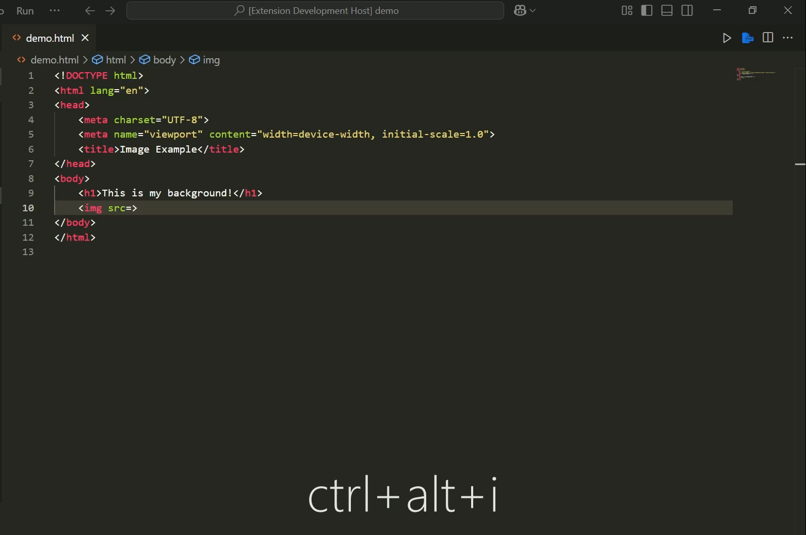

#  Path Adder

A Visual Studio Code extension to quickly insert file paths into your code with customizable options such as relative or absolute paths, forward or backward slashes, and quote styles (single, double, or none). This extension streamlines your development process, saving you time by allowing you to easily insert file paths in various formats directly within the editor.

---

 

---

## Features

- **Internal File Picker**: Browse through your workspace files and insert their paths with your preferred format.
- **File Explorer Integration**: Use the file explorer to select files and insert paths into your code.
- **Path Type Customization**: Choose between absolute or relative file paths.
- **Slash Direction**: Select between forward slashes (`/`) or backward slashes (`\`).
- **Quote Style Options**: Wrap paths in double quotes (`""`), single quotes (`''`), or no quotes at all.

---

## Installation

1. Open **Visual Studio Code**.
2. Go to the **Extensions View** by clicking on the Extensions icon in the Activity Bar on the side of the window.
3. Search for **Path Adder** in the marketplace search bar.
4. Click **Install**.

---

## Usage

### Commands

Once the extension is installed, the following commands will be available:

1. **Internal File Picker**  
   Opens a file picker for selecting files from your workspace, with options for customizing the file path format.

   - Command: `Path Adder: Internal File Picker`

2. **File Explorer**  
   Opens the native file explorer to select a file and inserts its path into your code with customizable options.

   - Command: `Path Adder: File Explorer`

### Workflow

1. **Internal File Picker**:  
   - Trigger the command to open the file picker.
   - Select a file from your workspace.
   - Choose the path format (relative or absolute).
   - Select the slash direction (forward or backward).
   - Choose the quote style (single, double, or none).
   - The file path is inserted at your cursor position.

2. **File Explorer**:  
   - Trigger the file explorer command to browse your system.
   - Select a file and choose the same options for path format, slash direction, and quote style.
   - The file path is inserted at your cursor position.

---

## Configuration

The extension currently supports the following options:

- **Slash Direction**:  
  - Choose between forward slashes (`/`) or backward slashes (`\`).
  
- **Path Type**:  
  - Select between relative and absolute paths.

- **Quote Style**:  
  - No quotes (`""`, `''`), or with single or double quotes.

---

## Keybindings

- **Internal File Picker**:  
  - Windows/Linux: `Ctrl+Alt+I`  
  - macOS: `Cmd+Alt+I`
  
- **File Explorer**:  
  - Windows/Linux: `Ctrl+Alt+P`  
  - macOS: `Cmd+Alt+P`

You can modify these keybindings in the **Keyboard Shortcuts** menu in VS Code.

---

## Contributing

We welcome contributions! If you'd like to help improve this extension, please fork the repository and submit a pull request. Here are some ways you can contribute:

- Bug reports and feature requests
- Code improvements or documentation

---

## License

This extension is licensed under the [MIT License](LICENSE).

---

## Changelog

### 0.0.1
- Initial release with support for internal file picker, file explorer, and customizable path formats.

### 0.0.2
- icon and doc patch